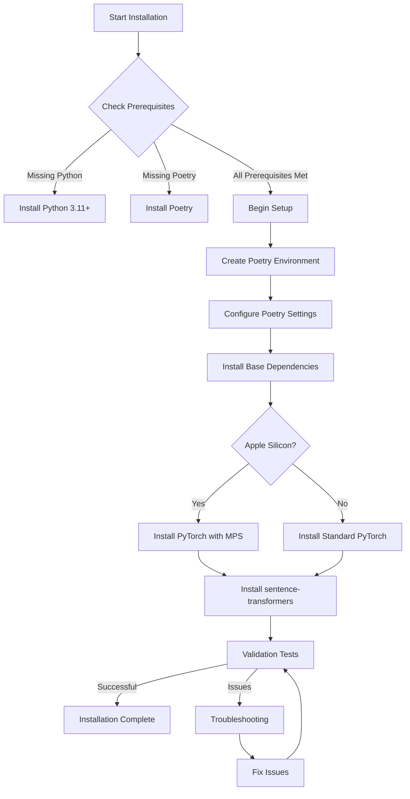

# Ollama Workbench Setup Overhaul Plan

## Problem Statement

The current setup process for Ollama Workbench has several issues when used on Apple Silicon (M1/M2/M3/M4) Macs:

1. **PyTorch Compatibility Issues**:
   - Error: `operator torchvision::nms does not exist` indicates incompatibility between torch and torchvision
   - Current setup uses CPU-only wheels, missing Apple Silicon GPU acceleration via MPS
   - Conflicting installation methods (uninstalling and reinstalling torch)

2. **Environment Management Issues**:
   - Mixing conda and Poetry creates confusion
   - Inconsistent activation methods
   - Unclear dependency management strategy

3. **Missing or Problematic Dependencies**:
   - Missing `groq_utils.py` file reference in imports
   - Sentence-transformers compatibility issues with torch

## Implementation Plan

### 1. Streamlined Installation Flow

### 2. Dependency Management Strategy

We will exclusively use Poetry for dependency management, as it:
- Provides superior dependency resolution
- Maintains a clean separation of dependencies
- Uses a clear, standardized format in pyproject.toml
- Simplifies virtual environment management

### 3. Updated `pyproject.toml`

The updated `pyproject.toml` will include:

- Specific versions for PyTorch and TorchVision that support MPS for Apple Silicon
- Compatible versions of sentence-transformers and transformers
- All other dependencies with explicit version pinning
- Consistent organization of dependencies

Key package versions:
- torch: 2.3.0 - Latest version with full Apple Silicon support
- torchvision: 0.18.0 - Compatible with torch 2.3.0
- sentence-transformers: 2.5.0 - Latest stable version
- transformers: 4.38.0 - Version compatible with sentence-transformers

### 4. New `setup.sh` Script

The new setup script will:

1. **Improve User Experience**:
   - Add color-coded output for better readability
   - Include clear progress indicators
   - Provide detailed error messages and recovery suggestions

2. **Improve Hardware Detection**:
   - Automatically detect Apple Silicon vs Intel chips
   - Apply optimized installation paths based on hardware

3. **Improve Environment Setup**:
   - Remove mixed conda/poetry approach
   - Configure Poetry environment correctly
   - Ensure proper activation

4. **Add Validations**:
   - Test PyTorch with MPS acceleration on Apple Silicon
   - Verify all key modules can be imported
   - Check environment activations

5. **Fix Missing Dependencies**:
   - Create placeholder for groq_utils.py if missing
   - Handle the sentence-transformers/torch dependency chain

### 5. Updated `run_ollama_workbench.sh`

The updated runner script will:

1. Automatically use the Poetry environment
2. Include Ollama server checks and startup if needed
3. Provide clearer error messages
4. Ensure clean shutdown of processes

### 6. Installation Testing Strategy

For validation, we'll create a Python script that:

1. Tests PyTorch installation and MPS availability
2. Verifies TorchVision compatibility
3. Tests sentence-transformers imports
4. Checks all other key dependencies
5. Reports detailed results to the user

## Next Steps

1. Update pyproject.toml with correct dependencies
2. Create new setup.sh script with Apple Silicon optimizations
3. Update run_ollama_workbench.sh for better integration
4. Create validation script
5. Test the entire flow on an Apple Silicon Mac